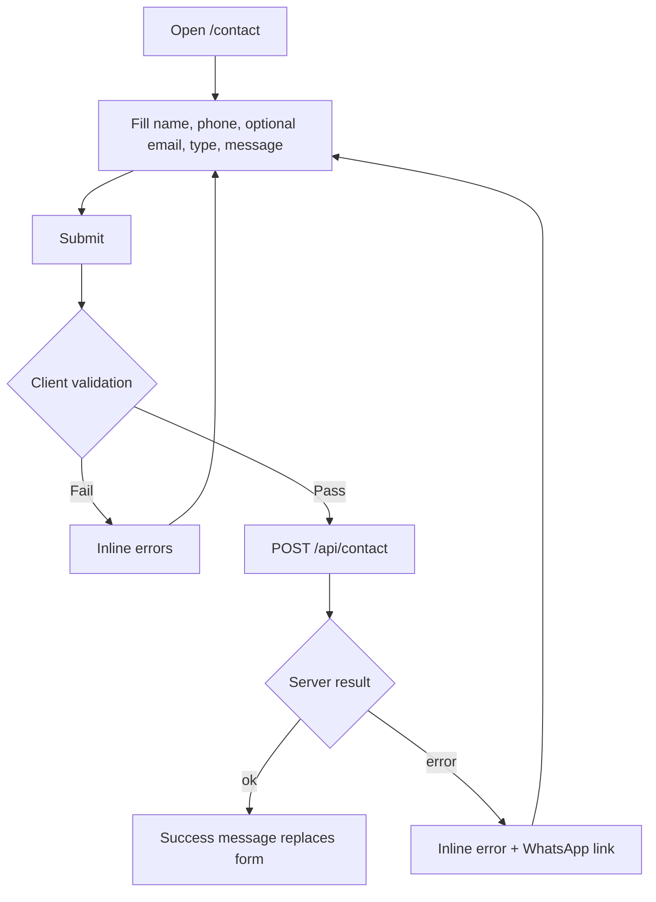
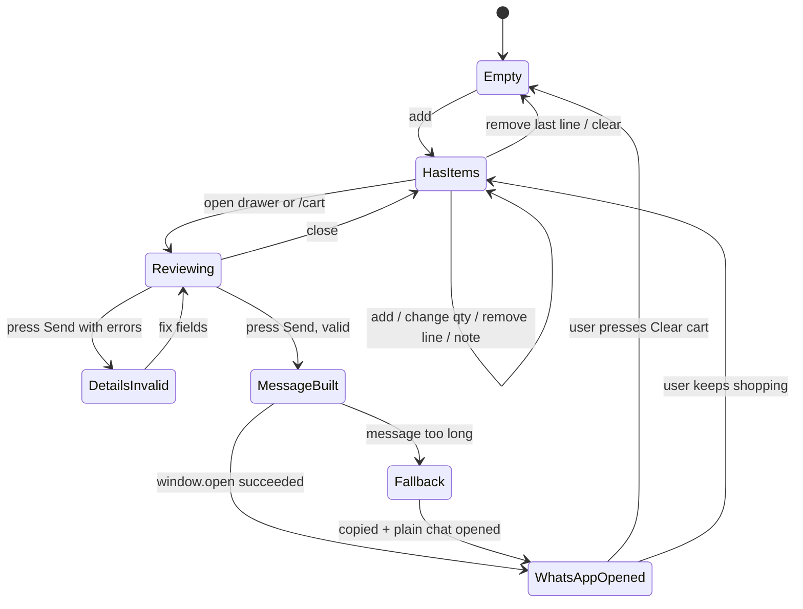

# User Flows: Shiv Mishthan Bhandar Website

> How people move through the site and what happens at every step. Read `prd.md` first. Layouts are in `UI.md`, code details in `trd.md`. Flow diagrams use Mermaid; the numbered steps beneath each diagram are authoritative.

## 1. People and goals

| Person                    | Situation                                    | What they want                                                           |
| ------------------------- | -------------------------------------------- | ------------------------------------------------------------------------ |
| **Anita, family buyer**   | On her phone, planning sweets for a festival | See sizes and prices, build a basket, send it to the shop without a fuss |
| **Rohan, cake buyer**     | Needs a birthday cake today                  | Pick size, add the message for the cake, order fast                      |
| **Mr. Gupta, regular**    | Does not like typing                         | Tap once and call the shop                                               |
| **Neha, curious visitor** | Heard about the shop, never visited          | Understand the shop's history and trust it                               |

## 2. Navigation map

```
Home ─┬─ Sweets ───────┐
      ├─ Restaurant ───┤── Product detail ──► Cart drawer ──► /cart ──► WhatsApp
      ├─ Bakery ───────┤
      ├─ Namkeen ──────┘
      ├─ About
      ├─ Contact
      └─ Search overlay (from any page) ──► Product detail
Always available: Call (tel:) · WhatsApp chat (wa.me) · Cart drawer · Header nav · Footer
```

Entry points: direct URL, Google, Instagram or WhatsApp link, QR code in the shop. Any page can be the first page, so every page shows the full header, footer and floating actions.

## 3. Primary flows

### F1. Browse → add to cart → send order on WhatsApp (core flow)

```mermaid
flowchart TD
  A[Land on Home or category] --> B[Browse products and filter]
  B --> C{Variants?}
  C -- Yes --> D[Pick size or weight]
  C -- No --> E[Add to cart]
  D --> E
  E --> F[Toast + header count updates]
  F --> G{Keep shopping?}
  G -- Yes --> B
  G -- No --> H[Open cart drawer]
  H --> I[Review lines, edit quantities]
  I --> J[Proceed to checkout]
  J --> K[/cart page: fill name, order type, address]
  K --> L{Valid?}
  L -- No --> M[Inline errors, focus first error]
  M --> K
  L -- Yes --> N[Send order on WhatsApp]
  N --> O[WhatsApp opens with message pre-filled]
  O --> P[Customer taps Send in WhatsApp]
  P --> Q[Site shows confirmation + Clear cart option]
```

Steps

1. Visitor lands on a page and browses a category (grid with filters, sort, Load more).
2. On a card they choose a variant (default is the first) and press **Add to cart**. The button becomes a quantity stepper. A toast confirms: "Kaju Katli (500 g) added". The header cart count bumps. `aria-live` announces it. The drawer does **not** open automatically.
3. They continue browsing, or tap the cart icon (or the mobile mini-cart bar's "View cart") to open the **drawer**.
4. In the drawer they change quantities (1 to 20), remove lines, and see subtotal and the delivery note. Primary button: **Proceed to checkout** → `/cart`.
5. On `/cart` they fill **Name**, **Order type**, **Address** (if delivery), optional **Preferred time** and **Notes**. Details are remembered on this device for next time.
6. They press **Send order on WhatsApp**. Validation runs (§5). On success the order message is built (§6), `begin_checkout` is tracked, and WhatsApp opens with the text in the chat box.
7. The cart stays intact. The page shows: "WhatsApp is open with your order. Send the message there to finish." with `Clear cart` and `Back to shop`.
8. The shop receives the message and confirms manually (outside the website).

### F2. Order a single item from the product page

1. Visitor opens `/{category}/{slug}`, picks variant and quantity, optionally types the cake message (only when `allowNote`).
2. Two choices: **Add to cart** (continue F1) or **Order this on WhatsApp**, which builds a one-item message (same format as §6, without customer details) and opens WhatsApp immediately.
3. If the product is unavailable both buttons are disabled and the page says "Currently unavailable".

### F3. Call the shop

1. Visitor taps the floating **Call** button (or the phone number in the header/footer/contact page).
2. `tel:{{CALL_NUMBER}}` opens the dialler on mobile. On desktop, the browser's default `tel:` handler runs; the number is also visible as text.
3. `call_click` is tracked.

### F4. Ask a question on WhatsApp (no cart)

1. Visitor taps the floating **WhatsApp** button.
2. `https://wa.me/{{WHATSAPP_NUMBER}}?text=Hello, I would like to place an order.` opens. `whatsapp_click` is tracked.

### F5. Contact form



1. Visitor completes the form; the hidden honeypot stays empty; a render timestamp is included.
2. On submit the button shows a spinner and is disabled. The API validates, applies spam checks and emails the owner.
3. Success: "Thank you. We will call or message you soon." with `Send another`. Failure: "We could not send that. Please try again or message us on WhatsApp." plus a WhatsApp link.

### F6. Search

1. Visitor opens search (header icon or `/` key on desktop).
2. Typing shows up to 8 instant results across all categories (name prefix first).
3. `Enter` opens the first result; click opens that product. `Esc` closes and returns focus to the search icon.
4. No results: message from `UI.md` §3.3.

### F7. Filter and sort a category

1. Visitor selects subcategory, price band, diet, in-stock toggle, or sort.
2. Results update instantly, the count updates, the URL query string updates (`?sub=ladoo&price=200-500&sort=plh`).
3. Refresh or share the link: same state. Back button steps back through states.
4. No matches → empty state with `Clear filters`. "Load more" resets to page 1 whenever filters change.

### F8. Understand the brand (About)

1. Neha opens `/about` from the nav or the Home legacy section.
2. She scrolls through the pinned **journey timeline** (past → today → future goals), then reads what the shop stands for and the founder's note.
3. Closing block offers **WhatsApp** and **Call** and links to the four categories.

## 4. Cart and checkout state machine



Rules

- The cart is only cleared by an explicit `Clear cart` or by removing all lines. Opening WhatsApp never clears it.
- State persists in `localStorage` (key `smb-cart-v1`); reload keeps lines, order note and remembered customer details.
- Lines reference product and variant ids only; prices are looked up live. A line whose product or variant no longer exists is silently removed on load, with a toast: "Some items are no longer available and were removed."
- Max quantity per line 20. At 20, the plus button is disabled and a hint reads "Maximum 20 per item. For bulk orders, contact us." linking to `/contact`.

## 5. Validation and field rules

| Field           | Rule                                                                   | Error text                                             |
| --------------- | ---------------------------------------------------------------------- | ------------------------------------------------------ |
| Name (checkout) | Required, 2 to 60 characters                                           | Please tell us your name so we can address your order. |
| Order type      | Required, one of delivery or pickup                                    | Choose home delivery or store pickup.                  |
| Address         | Required if delivery; 10 to 300 characters                             | Add a delivery address, or choose Store pickup.        |
| Preferred time  | Optional, max 60 characters                                            | (none)                                                 |
| Notes           | Optional, max 300 characters                                           | Please keep notes under 300 characters.                |
| Cake message    | Only when `allowNote`; max 60 characters                               | Cake message can be up to 60 characters.               |
| Contact name    | Required, 2 to 60                                                      | Please enter your name.                                |
| Contact phone   | Required, 10 digits after removing spaces, `+91` and leading 0 allowed | Enter a 10-digit mobile number.                        |
| Contact email   | Optional; must be a valid email if present                             | That email does not look right.                        |
| Contact message | Required, 10 to 1000 characters                                        | Please write a short message (at least 10 characters). |

Behaviour: validate on blur and on submit; on submit with errors, focus the first invalid field and announce errors via `aria-live`. Trim all text. Strip control characters. Never lose what the user typed.

## 6. WhatsApp message (exact format and example)

Built by `buildOrderMessage` (TRD §7). Bold uses WhatsApp's `*text*`. Optional lines are omitted when empty.

```
*New order: Shiv Mishthan Bhandar*
Order ID: SMB-300926-4F2K

*Items*
1. Kaju Katli (500 g) x 2 = ₹1,300
2. Chocolate Truffle Cake (1 kg) x 1 = ₹850
   Message on cake: Happy Birthday Riya
3. Aloo Bhujia (200 g) x 3 = ₹360

*Subtotal: ₹2,510*
Delivery charges, if any, to be confirmed.

*Customer*
Name: Anita
Order type: Home delivery
Address: 12, Sample Nagar, Sample City
Preferred time: Today, 6 PM
Notes: Please pack the sweets separately.
```

Pickup variant: replace the address line with nothing (omit it) and show `Order type: Store pickup`.
Single-item quick order (F2) uses the same header, items and subtotal blocks, and omits the Customer block.

Delivery: URL = `https://wa.me/{{WHATSAPP_NUMBER}}?text=` + `encodeURIComponent(message)`. If the URL exceeds 1,800 characters: copy the message to the clipboard, open `https://wa.me/{{WHATSAPP_NUMBER}}`, and toast "Your order is long. We copied it, paste it in the chat and send."

## 7. Edge cases

| Case                               | Expected behaviour                                                                                                                |
| ---------------------------------- | --------------------------------------------------------------------------------------------------------------------------------- |
| Cart empty and user opens `/cart`  | Empty state with `Browse sweets`; checkout panel hidden                                                                           |
| Product unavailable                | Cannot add; if already in cart (became unavailable), the line shows "Currently unavailable" and checkout is blocked until removed |
| Popup blocked by browser           | Fall back to `location.href = url`                                                                                                |
| WhatsApp not installed (desktop)   | `wa.me` opens WhatsApp Web; nothing extra needed                                                                                  |
| User edits the message in WhatsApp | Allowed; website is unaware                                                                                                       |
| JavaScript disabled                | Pages and product lists render (SSG); cart features unavailable; floating `tel:` and `wa.me` links still work                     |
| Slow network                       | Skeletons for the grid; images use blur placeholder; drawers work from local state                                                |
| Offline after load                 | Cart and static pages still work; contact form shows the error state                                                              |
| Returning visitor                  | Cart and customer details restored from `localStorage`                                                                            |
| Direct link to a removed product   | 404 page with links to the four categories                                                                                        |
| Reduced motion                     | Static layouts per `UI.md` §8; all flows unchanged                                                                                |
| Keyboard only                      | Every flow completable; drawers trap focus; `Esc` closes                                                                          |
| Very small screens (320 px)        | No horizontal scroll except intended carousels; buttons stay ≥44 px                                                               |

## 8. Analytics event map (only when `NEXT_PUBLIC_GA_ID` is set)

| Event            | Fired when                                          | Params                                         |
| ---------------- | --------------------------------------------------- | ---------------------------------------------- |
| `add_to_cart`    | Add pressed                                         | `item_id`, `variant`, `qty`, `category`        |
| `begin_checkout` | WhatsApp opened from `/cart` or product quick order | `items`, `value`                               |
| `call_click`     | Any `tel:` link pressed                             | `location` (floating, header, footer, contact) |
| `whatsapp_click` | Plain chat link pressed                             | `location`                                     |
| `contact_submit` | Contact API returned ok                             | `type`                                         |
| `search`         | Search result opened                                | `query_length`                                 |

No personal data (name, address, phone, message text) is ever sent to analytics.

## 9. Acceptance scenarios

1. **Festival basket.** Given an empty cart, when I add Kaju Katli 500 g ×2 and Motichoor Ladoo 1 kg ×1 and open the cart, then I see two lines with correct line totals and subtotal; after choosing Home delivery with name and address and pressing Send order on WhatsApp, WhatsApp opens with both items, quantities, totals, my details and an order ID.
2. **Cake with message.** Given a cake with `allowNote`, when I add it with "Happy Birthday Riya", then the note shows in the drawer, on `/cart` and in the WhatsApp message under that line.
3. **Pickup.** Given pickup is selected, then the address field is hidden, not required, and absent from the message.
4. **Persistence.** Given items in the cart, when I reload or return tomorrow, then the cart is intact and prices reflect current product data.
5. **Filter share.** Given `/sweets?sub=ladoo&sort=plh`, when I open the link in a new tab, then the same filter and sort are applied.
6. **Long order.** Given 20 distinct lines, when I press Send, then the message is copied, plain chat opens, and the toast explains how to paste.
7. **Direct call.** On any page, one tap on the Call button starts a call to `{{CALL_NUMBER}}`.
8. **Contact spam.** Given the honeypot field is filled, then the API reports success but sends no email.
9. **Reduced motion.** With reduced motion on, no pinning, scrubbing or rotation occurs and every section is readable and complete.
10. **Keyboard.** I can go from the home page to a sent WhatsApp order using only the keyboard.
